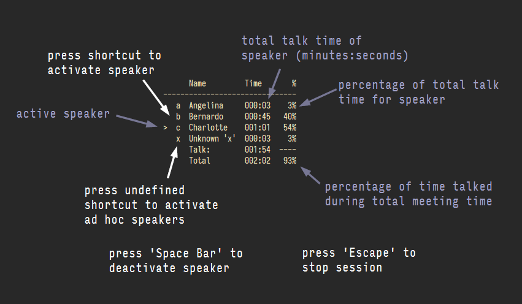

# mtngtmr
Meeting Timer to Measure Talk Times of Participants
```
      Name         Time       %
-------------------------------
   a  Angelina     000:03    4%
   b  Bernardo     000:45   55%
>  c  Charlotte    000:30   36%
   x  Unknown 'x'  000:03    4%
      Talk:        001:23  ----
      Total        001:31   91%

```
1. `dotnet run test.json create` to create a new data file `test.json`, which contains keyboard shortcut definitions for participants and recorded sessions
2. add and adapt participants' names and shortcuts in the `Shortcuts` section of the json data file
3. start a new session with `dotnet run test.json session ["session name"]` (session name is optional) to run a new session

4. press shortcut id to activate speaker; press `Space Bar` to deactivate; press new shortcut to add non-predefined ad hoc speaker (remember real name mapping! ;-); press `Escape` to exit session
5. for now, session data can be found at the end of the json data file; run your own reporting